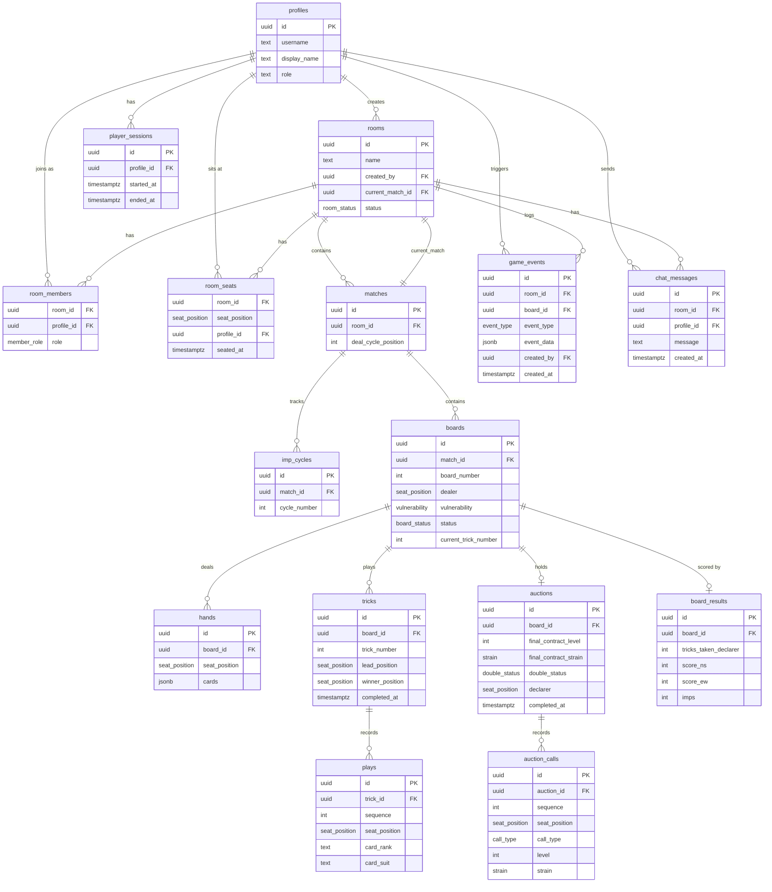

# Bridge Partners

## Project Description

**Bridge Partners** is a real-time multiplayer online Bridge card game that lets groups of friends play together remotely through a browser. It supports the full lifecycle of a Bridge session — from authentication and lobbying through bidding, card play, and scoring — without requiring any installation beyond a modern web browser.

### What users can do

| Role | Capabilities |
|---|---|
| **Registered Player** | Register / log in, join the lobby, sit at a table (North / South / East / West), participate in the auction (bidding) and card play, view own hand and dummy, chat, track personal statistics |
| **Observer** | Join a room without sitting, watch all four hands in real time, follow bidding and card play |
| **Admin** | Manage player accounts, reset statistics, delete players via a dedicated admin panel |

Key gameplay features:
- Automatic 16-deal vulnerability cycle (IMP-scored)
- Real-time game state synchronisation across all connected clients
- Hand privacy enforced at the application layer (players only see their own cards until dummy is revealed)
- Bilingual UI — English and Bulgarian (persisted in `localStorage`)
- Responsive Bootstrap-based design

---

## Architecture

### Overview

```
Browser (SPA)  ─────────────────────────────────────────────────────────────
│  Vite + Vanilla JS + Bootstrap                                            │
│  src/pages/* · src/components/* · src/bridge/*                           │
└─────────────────┬─────────────────────────────────────────────────────────
                  │ HTTPS / WebSocket
Supabase (BaaS) ──┴─────────────────────────────────────────────────────────
│  Auth (JWT)          Realtime (PostgreSQL CDC)                            │
│  REST API (PostgREST) Storage                                             │
│                                                                           │
│  PostgreSQL database                                                      │
└───────────────────────────────────────────────────────────────────────────
```

### Technology Stack

| Layer | Technology |
|---|---|
| **Front-end** | Vite 5, Vanilla JavaScript (ES Modules), Bootstrap 5 |
| **Back-end / BaaS** | Supabase (Auth, PostgREST, Realtime, Storage) |
| **Database** | PostgreSQL (managed by Supabase) |
| **Authentication** | Supabase Auth (JWT, `sessionStorage` per tab) |
| **Real-time** | Supabase Realtime (PostgreSQL Change Data Capture) |
| **Hosting** | Netlify (SPA history fallback via `netlify.toml`) |
| **Source control** | GitHub |

### Front-end SPA details

- Single `index.html` entry point; client-side routing with `history.pushState` (no hash URLs)
- Vite configured with `appType: 'spa'` for dev-server fallback
- Each page/component lives in its own folder with separate `.html`, `.css`, and `.js` files
- Stateless render functions receive `{ language, t, applyTranslations, onLanguageChange, navigate }` as parameters
- Header and footer render once at startup; page content renders into the `<main>` outlet on navigation
- Auth tokens stored in `sessionStorage` (per-tab isolation — multiple users can be logged in simultaneously in different tabs)

### Routes

| URL | Page |
|---|---|
| `/` | Home — login / register |
| `/lobby` | Lobby — list and join tables |
| `/table` | Table — active game |
| `/observer` | Observer — spectator view |
| `/statistics` | Player statistics |
| `/resources` | Learning resources |
| `/admin` | Admin panel (admin role required) |

---

## Database Schema

The PostgreSQL database is hosted on Supabase. Row Level Security (RLS) is enabled on every table.

### Entity Relationship Diagram



### Key Design Decisions

- **Hand privacy** — all four hands are stored in the `hands` table; the application layer restricts what each client can see (own hand, dummy after opening lead)
- **Event sourcing** — `game_events` is an append-only log enabling Realtime pub/sub, reconnection recovery, and replay
- **Vulnerability cycle** — `matches.deal_cycle_position` (0–15) drives the 16-deal IMP vulnerability pattern; resets when the player roster changes
- **Per-tab auth** — `sessionStorage` is used instead of `localStorage` so that each browser tab holds an independent session

---

## Local Development Setup

### Prerequisites

- [Node.js](https://nodejs.org/) ≥ 18
- A [Supabase](https://supabase.com/) project (free tier is sufficient)
- Git

### Steps

1. **Clone the repository**

   ```bash
   git clone <repo-url>
   cd bridge_partners
   ```

2. **Install dependencies**

   ```bash
   npm install
   ```

3. **Configure environment variables**

   Create a `.env.local` file in the project root (this file is git-ignored):

   ```env
   VITE_SUPABASE_URL=https://<your-project-ref>.supabase.co
   VITE_SUPABASE_ANON_KEY=<your-anon-key>
   ```

   Find both values in your Supabase project: **Settings → API**.

4. **Apply database migrations**

   Run the SQL files in `migrations/` against your Supabase project in order (e.g. via the Supabase SQL Editor or the CLI):

   ```
   migrations/20_create_lobby_tables.sql
   migrations/23_create_chat_messages.sql
   … (apply all in numeric order)
   ```

5. **Start the development server**

   ```bash
   npm run dev
   ```

   The app will be available at [http://localhost:5000](http://localhost:5000).

### Available Scripts

| Command | Description |
|---|---|
| `npm run dev` | Start Vite dev server on port 5000 with SPA history fallback |
| `npm run build` | Build optimised production bundle into `dist/` |
| `npm run preview` | Preview the production build on port 5000 |
| `npm run supabase:pull` | Pull remote Supabase schema into local migration files |

### Pulling remote schema changes

```bash
# One-time setup: set these environment variables on your machine
SUPABASE_ACCESS_TOKEN=<your-token>   # Dashboard → Account → Access Tokens
SUPABASE_DB_PASSWORD=<db-password>   # Project Settings → Database

npm run supabase:pull
```

Run this weekly and after any database change to keep local migrations in sync.

---

## Key Folders and Files

```
bridge_partners/
├── index.html                    # SPA shell — single entry point
├── vite.config.js                # Vite config: appType spa, port 5000, @ alias
├── netlify.toml                  # Netlify deploy config (SPA history fallback)
├── package.json                  # Node dependencies and npm scripts
├── .env.local                    # (git-ignored) Supabase URL + anon key
│
├── migrations/                   # Numbered SQL migration files applied to Supabase
│   └── NN_description.sql
│
├── public/                       # Static assets served as-is (favicons, images)
│
└── src/
    ├── main.js                   # App bootstrap: routing, layout shell, auth guard
    ├── routes.js                 # Route table mapping URL paths to page modules
    ├── supabase.js               # Supabase client (sessionStorage auth)
    │
    ├── styles/
    │   └── main.css              # Global shared styles
    │
    ├── i18n/
    │   └── i18n.js               # EN/BG translations, language persistence helpers
    │
    ├── session/
    │   └── session-manager.js    # Auth session lifecycle and user state management
    │
    ├── api/                      # Supabase API wrappers (rooms, seats, boards, etc.)
    │
    ├── bridge/
    │   ├── auction.js            # Bidding logic (valid calls, contract resolution)
    │   ├── auction.test.js       # Unit tests for auction logic
    │   ├── imp-cycle.js          # 16-deal vulnerability cycle calculations
    │   └── cycle-dialog.js       # UI component for the IMP cycle overlay
    │
    ├── components/
    │   ├── header/               # Site-wide header (nav, user info, language picker)
    │   └── footer/               # Site-wide footer
    │
    └── pages/
        ├── home/                 # Login / registration page
        ├── lobby/                # Table list, create/join room
        ├── table/                # Active game: bidding, card play, scoring
        ├── observer/             # Spectator view (all hands visible)
        ├── statistics/           # Player game history and IMP totals
        ├── resources/            # Learning resources / PDF viewer
        └── admin/                # Admin panel: manage players, reset stats
```
