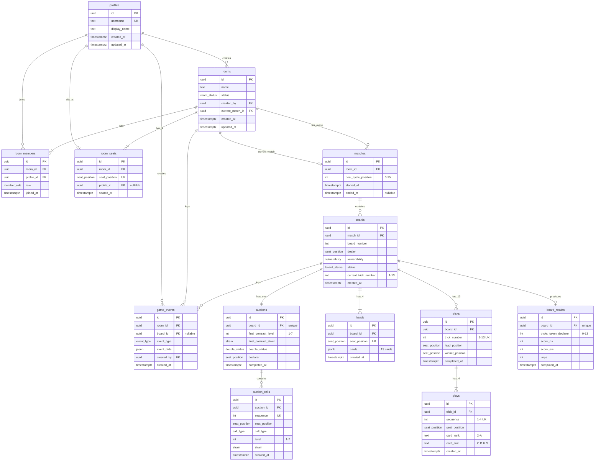

# Database Entity Relationship Diagram



## Key Relationships

### One-to-Many
- **Room → Members**: One room has many members (players + spectators)
- **Room → Seats**: One room has exactly 4 seats (N/S/E/W)
- **Match → Boards**: One match contains multiple boards (deals)
- **Board → Tricks**: One board has exactly 13 tricks
- **Trick → Plays**: One trick has exactly 4 plays

### One-to-One
- **Board → Auction**: One board has exactly one auction
- **Board → Result**: One board produces one result
- **Room → Current Match**: One room has at most one active match

### Many-to-Many
- **Profiles ↔ Rooms**: Through `room_members` (many users can join many rooms)

## Constraints & Business Rules

### Unique Constraints
- `(room_id, profile_id)` in room_members - user joins room once
- `(room_id, seat_position)` in room_seats - one player per seat
- `(room_id, profile_id)` in room_seats - one seat per player per room
- `(match_id, board_number)` in boards - sequential board numbering
- `(board_id, seat_position)` in hands - one hand per seat per board
- `(auction_id, sequence)` in auction_calls - ordered bidding
- `(board_id, trick_number)` in tricks - numbered 1-13
- `(trick_id, sequence)` in plays - 4 cards per trick
- `board_id` in auctions - one auction per board
- `board_id` in board_results - one result per board

### Check Constraints
- `deal_cycle_position` ∈ [0, 15]
- `board_number` > 0
- `current_trick_number` ∈ [1, 13]
- `final_contract_level` ∈ [1, 7]
- `tricks_taken_declarer` ∈ [0, 13]
- `auction_calls.level` ∈ [1, 7]
- `card_rank` ∈ {2, 3, 4, 5, 6, 7, 8, 9, 10, J, Q, K, A}
- `card_suit` ∈ {C, D, H, S}

### Referential Integrity
- **Cascading Deletes**: 
  - Delete room → deletes members, seats, matches, events
  - Delete board → deletes hands, auction, tricks, results
  - Delete trick → deletes plays
  
- **Set Null**: 
  - Delete profile from room_seats → seat becomes vacant
  - Delete match → room.current_match_id becomes null

## Index Strategy

### High-Traffic Indexes
```sql
-- Real-time event queries (most critical)
idx_game_events_room_time (room_id, created_at DESC)

-- Room state queries
idx_room_members_room (room_id)
idx_room_seats_room (room_id)

-- Board state queries
idx_boards_match (match_id)
idx_auction_calls_sequence (auction_id, sequence)
idx_plays_sequence (trick_id, sequence)
```

### Lookup Indexes
```sql
-- User lookups
idx_room_members_profile (profile_id)
idx_rooms_created_by (created_by)

-- Status filters
idx_rooms_status (status)
idx_boards_status (status)
```

## Data Flow Examples

### Creating a New Game
```
1. User creates room → rooms
2. Users join → room_members
3. Users take seats → room_seats
4. System creates match → matches
5. System updates room → rooms.current_match_id
6. System deals board → boards
7. System deals cards → hands (4 inserts)
8. Log event → game_events
```

### Playing a Board
```
Auction Phase:
1. Create auction → auctions
2. Players bid → auction_calls (insert per call)
3. Complete auction → auctions.final_contract_*
4. Update board → boards.status = 'play'

Play Phase:
1. Create trick → tricks
2. Players play → plays (4 inserts)
3. Complete trick → tricks.winner_position
4. Repeat 13 times

Scoring:
1. Compute result → board_results
2. Update board → boards.status = 'completed'
```

### Real-time Sync
```
Every state change:
1. Update game state tables
2. Append event → game_events
3. Supabase broadcasts to subscribers
4. Clients receive and render update
```

## Performance Considerations

### Hot Tables (Frequent Writes)
- `game_events` - every action
- `auction_calls` - every bid
- `plays` - every card

### Hot Tables (Frequent Reads)
- `game_events` - real-time subscriptions
- `boards` - current game state
- `hands` - card visibility checks
- `room_seats` - who's playing

### Cold Tables
- `matches` - created once per session
- `board_results` - written once per board
- `rooms` - mostly read after creation

### Optimization Tips
1. **Batch reads**: Fetch full board state in one query with joins
2. **Denormalize**: Store computed values (declarer, dummy, current_trick)
3. **Partition**: Consider partitioning `game_events` by `created_at` for long-term storage
4. **Archive**: Move completed boards to separate table after 30 days
